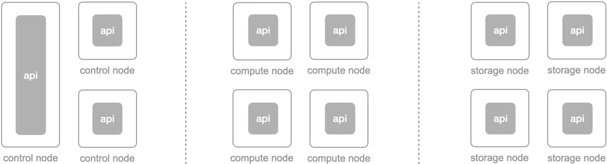

<!-- PROJECT LOGO -->
 

  
  

[![License][License-Image]][License-Url] [![made-with-Go][Go-Made-Image]][Go-Made-Url] [![Go][Go-Report-Image]][Go-Report-Url] [![GitHub issues][Github-Issue-Image]][Github-Issue-Url] [![GitHub last commit (branch)][GitHub-Last-Commit-Image]][GitHub-Last-Commit-Url]

⛩️ [Architecture] | 👷‍♂️ [Developing] | 🔬 [Troubleshooting]

  

## ▎Overview

The cube-cos api is a central communication mechanism in the CubeCOS written in [Go]. Each node has its own cube-cos api and discover peer nodes by [MDNS] for cross-node communication.

Additionally, there’re 14+ apis in the CubeCOS, the cube-cos api is just one of apis which responsible for the partial native features of cube-cos currently, but it will cover more and more features in the incoming milestones.

 

 
 
 

## ▎License

Copyright (c) 2025 [Bigstack co., ltd](https://bigstack.co/)

Licensed under the Apache License, Version 2.0 (the "License");
you may not use this file except in compliance with the License.
You may obtain a copy of the License at

[http://www.apache.org/licenses/LICENSE-2.0](http://www.apache.org/licenses/LICENSE-2.0)

Unless required by applicable law or agreed to in writing, software
distributed under the License is distributed on an "AS IS" BASIS,
WITHOUT WARRANTIES OR CONDITIONS OF ANY KIND, either express or implied.
See the License for the specific language governing permissions and
limitations under the License.

[Architecture]: https://github.com/bigstack-oss/cube-cos-api/docs/architecture
[Developing]: https://github.com/bigstack-oss/cube-cos-api/docs/developing
[Troubleshooting]: https://github.com/bigstack-oss/cube-cos-api/docs/troubleshooting
[Go]: https://go.dev/
[MDNS]: https://en.wikipedia.org/wiki/Multicast_DNS
[License-Url]: https://www.apache.org/licenses/LICENSE-2.0
[License-Image]: https://img.shields.io/badge/License-Apache2-blue.svg
[Go-Report-Url]: https://goreportcard.com/report/github.com/bigstack-oss/cube-cos-api
[Go-Report-Image]: https://goreportcard.com/badge/github.com/bigstack-oss/cube-cos-api
[Go-Made-Image]: https://img.shields.io/badge/Made%20with-Go-1f425f.svg
[Go-Made-Url]: https://go.dev/
[GitHub-Issue-Url]: https://github.com/bigstack-oss/cube-cos-api/issues
[GitHub-Issue-Image]: https://img.shields.io/github/issues/bigstack-oss/cube-cos-api?color=brightgreen
[GitHub-Last-Commit-Url]: https://github.com/bigstack-oss/cube-cos-api/issues
[GitHub-Last-Commit-Image]: https://img.shields.io/github/last-commit/bigstack-oss/cube-cos-api/develop
