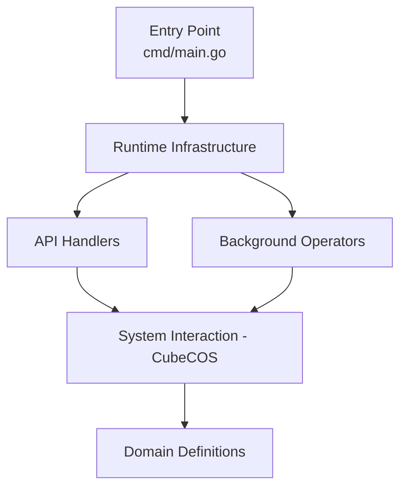

# Onboarding Guide — cube-cos-api

## Project Overview

|                 |                                                                                                                                                                 |
| --------------- | --------------------------------------------------------------------------------------------------------------------------------------------------------------- |
| **Name**        | cube-cos-api                                                                                                                                                    |
| **Languages**   | Go                                                                                                                                                              |
| **Frameworks**  | Gin, go-micro, MongoDB, InfluxDB, OpenStack, Kubernetes                                                                                                         |
| **Description** | Central communication API for CubeCOS cluster nodes — manages firmware, health monitoring, node operations, metrics, and integrations using MDNS peer discovery |

CubeCOS API is the central communication mechanism for CubeCOS cluster nodes. Each node runs an instance of this service, which discovers peers via MDNS. The node's **role** (control, compute, storage, moderator, edge-core) determines which API endpoints it registers.

---

## Architecture Layers



### 1. Entry Point

Application bootstrap and main function.

| File          | Summary                                                            |
| ------------- | ------------------------------------------------------------------ |
| `cmd/main.go` | Loads config, creates HTTP server, and starts the go-micro service |

### 2. Runtime Infrastructure

Server initialization, dependency setup, routing, authentication middleware, and microservice lifecycle.

| File                             | Summary                                                                                                                                |
| -------------------------------- | -------------------------------------------------------------------------------------------------------------------------------------- |
| `internal/service/service.go`    | Microservice lifecycle management — creates go-micro service with rate limiting, circuit breaker, registry, and operator orchestration |
| `internal/config/config.go`      | Configuration loading and management — reads YAML config files and syncs global system options                                         |
| `internal/runtime/runtime.go`    | Runtime initialization — combines server creation and dependency initialization                                                        |
| `internal/runtime/router.go`     | HTTP router setup — creates Gin router, registers all API handlers by node role, sets up middleware                                    |
| `internal/runtime/dependency.go` | External dependency initialization — sets up MongoDB, InfluxDB, OpenStack, Keycloak, Kubernetes, AWS clients                           |
| `internal/runtime/identity.go`   | Node identity resolution — determines node role, hostname, datacenter, VIP, and authentication setup                                   |
| `internal/runtime/filter.go`     | Request filtering middleware — authentication and authorization checks for API requests                                                |
| `internal/runtime/parse.go`      | Request parsing utilities — extracts common request parameters and validates inputs                                                    |
| `internal/auths/oidc/oidc.go`    | OIDC authentication middleware — validates tokens via OpenID Connect provider                                                          |
| `internal/auths/saml/saml.go`    | SAML 2.0 SP authentication — session management, metadata, redirect handling                                                           |

### 3. API Handlers

REST API endpoint handlers organized by domain module — request parsing, validation, response formatting, and SSE streaming.

Each handler module follows a consistent pattern:
- `handlers.go` — Route registrations and HTTP handler functions
- `helper.go` — Business logic delegation via a `helper` struct

| Module          | Summary                                                                                  |
| --------------- | ---------------------------------------------------------------------------------------- |
| `datacenters`   | Datacenter listing, firmware/fixpack info, rolling reboot operations                     |
| `events`        | Event listing with filtering, predefined events, event ranks, SSE streaming              |
| `firmwares`     | Firmware lifecycle — upload, verify MD5, upgrade, progress tracking, abort               |
| `fixpacks`      | Fixpack (hotpatch) lifecycle — upload, install, rollback, progress tracking              |
| `grafana`       | Generates Grafana dashboard deep-links for hosts, instances, networks, storages          |
| `healths`       | Health summary, per-service/module health history, repair operations, SSE streaming      |
| `images`        | VM image management — list materials, list/export images, import, update metadata        |
| `integrations`  | Third-party storage integration CRUD — Cinder backends, vendor/model management          |
| `licenses`      | License management — list, verify, import cluster/host licenses                          |
| `me`            | Returns current authenticated user information                                           |
| `metrics`       | Datacenter summary and detailed metrics (CPU, memory, disk, network) with SSE watch      |
| `nodes`         | Full node management — list, reboot, IPMI, drain, device CRUD, OSD management, GPU cards |
| `notifications` | Notification listing with filtering/pagination                                           |
| `settings`      | Cluster settings — title prefix, email senders/recipients, Slack channels                |
| `supportfiles`  | Diagnostic bundle management — create, list, download, delete support files              |
| `tokens`        | Authentication token creation (access + refresh) from user credentials                   |
| `triggers`      | Automation trigger management — CRUD, dry-run script verification                        |
| `tunings`       | System tuning parameter management — list specs, update, enable/disable, reset           |
| `volumes`       | Volume management — list/export volumes, image-to-volume conversion                      |

### 4. System Interaction (CubeCOS)

Business logic layer wrapping CLI tools (`hex_sdk`, `hex_config`), external service clients (InfluxDB, MongoDB, OpenStack, Ceph, Keycloak, S3), and OS-level operations.

| File                              | Summary                                                                                      |
| --------------------------------- | -------------------------------------------------------------------------------------------- |
| `internal/cubecos/nodes.go`       | Node inventory, role discovery, VIP ownership, GPU detection via MongoDB and OpenStack       |
| `internal/cubecos/firmware.go`    | Firmware lifecycle operations (list/upgrade/distribute) across cluster nodes via CLI and SSH |
| `internal/cubecos/fixpacks.go`    | Fixpack listing, installation, removal via hex_config CLI                                    |
| `internal/cubecos/health.go`      | Cluster health tracking — queries from InfluxDB, manages repair operations, S3 health alerts |
| `internal/cubecos/metric.go`      | Queries host/VM metrics from InfluxDB and local gopsutil                                     |
| `internal/cubecos/device.go`      | Manages Ceph OSD disk operations (add/promote/demote/remove) via hex_sdk                     |
| `internal/cubecos/image.go`       | VM image import via hex_sdk with pseudo-terminal progress tracking                           |
| `internal/cubecos/integration.go` | Cinder storage backend management via hex_sdk                                                |
| `internal/cubecos/license.go`     | License import, verification, and synchronization via CLI                                    |
| `internal/cubecos/tuning.go`      | System tuning parameter read/write from policy YAML files with cluster distribution          |
| `internal/cubecos/trigger.go`     | Alert trigger CRUD operations via hex_sdk                                                    |
| `internal/cubecos/token.go`       | Authentication token creation via Keycloak OIDC                                              |

### 5. Background Operators

Async background workers using Kubernetes workqueues, filesystem watchers, and periodic sync loops for long-running tasks.

| File                               | Summary                                                                |
| ---------------------------------- | ---------------------------------------------------------------------- |
| `internal/operators/v1/firmwares/` | Processes firmware upgrade requests asynchronously from a workqueue    |
| `internal/operators/v1/fixpacks/`  | Processes fixpack install/remove requests from a workqueue             |
| `internal/operators/v1/healths/`   | Health repair operations and periodic health history resync            |
| `internal/operators/v1/images/`    | Processes image import requests with progress tracking in MongoDB      |
| `internal/operators/v1/licenses/`  | Watches license files for changes and auto-syncs license state         |
| `internal/operators/v1/metrics/`   | Periodically refreshes cached metric summary data every 60 seconds     |
| `internal/operators/v1/nodes/`     | Watches node registry, syncs state, processes OSD/device operations    |
| `internal/operators/v1/settings/`  | Processes alert settings changes and watches policy files              |
| `internal/operators/v1/storages/`  | Processes storage backend and model CRUD requests from dual workqueues |
| `internal/operators/v1/triggers/`  | Manages alert trigger CRUD and watches trigger policy files            |
| `internal/operators/v1/tunings/`   | Applies tuning changes and watches tuning policy file for edits        |
| `internal/operators/v1/volumes/`   | Processes volume-to-image conversion requests asynchronously           |

### 6. Domain Definitions

Domain type definitions, DTOs, constants, error types, and shared data structures used across all layers. Located at `internal/definition/v1/`.

### 7. Build & CI/CD

| File                                    | Summary                                                                           |
| --------------------------------------- | --------------------------------------------------------------------------------- |
| `Taskfile.yaml`                         | Build task automation — compile, lint, test, generate swagger docs, RPM packaging |
| `.github/workflows/ci.yml`              | CI pipeline — runs linting and tests on pull requests                             |
| `build/cube-cos-api-binary.Jenkinsfile` | Jenkins pipeline for building the Go binary                                       |
| `build/cube-cos-api-rpm.Jenkinsfile`    | Jenkins pipeline for building RPM packages                                        |

---

## Key Concepts

### Role-Based API Registration

Each node only registers API handlers appropriate for its role. The `internal/apis/api.go` file maps handler modules to node roles (control, compute, storage, moderator, edge-core).

### Helper Pattern

All handler modules delegate business logic to a `helper` struct initialized per-request. This keeps HTTP handler functions thin and testable.

### Operator Pattern

Long-running or async operations (firmware upgrades, image imports, tuning changes) are processed by background **operators** using Kubernetes-style workqueues. API handlers enqueue work; operators dequeue and execute.

### hex_sdk / hex_config CLI

Most system-level operations go through platform CLI tools (`hex_sdk`, `hex_config`, `hex_install`). The `internal/cubecos/` package wraps these commands.

### SSE Streaming

Many endpoints support Server-Sent Events (SSE) for real-time updates via `?watch=true` query parameter.

### Cross-Node Communication

Nodes call each other's APIs via HTTP. The `internal/definition/v1/nodes/url.go` generates cross-node URLs. For GPU card listing, a control node will proxy to the target compute node.

---

## Guided Tour

Follow this path to understand the codebase from top to bottom:

### Step 1: Project Overview
Start with the README to understand CubeCOS API's purpose: it's the central communication mechanism for CubeCOS cluster nodes, using MDNS for peer discovery across control, compute, and storage roles.

**Files:** `README.md`, `docs/architecture/README.md`

### Step 2: Application Entry Point
The main function loads configuration, creates an HTTP server via the runtime package, and starts a go-micro microservice with rate limiting and circuit breaking.

**Files:** `cmd/main.go`, `internal/service/service.go`

### Step 3: Runtime & Server Setup
The runtime package initializes external dependencies (MongoDB, InfluxDB, OpenStack, Keycloak, Kubernetes), resolves node identity/role, and sets up the Gin HTTP router with authentication middleware.

**Files:** `internal/runtime/runtime.go`, `internal/runtime/dependency.go`, `internal/runtime/router.go`, `internal/runtime/identity.go`

### Step 4: Role-Based Handler Registration
The API registry maps handler modules to node roles. Each node only registers handlers appropriate for its role, enabling distributed API responsibilities.

**Files:** `internal/apis/api.go`, `internal/runtime/filter.go`

### Step 5: API Handler Pattern
Each handler module follows a consistent pattern: `handlers.go` defines route registrations, `helper.go` encapsulates business logic, with shared request/response utilities.

**Files:** `internal/apis/v1/handlers/nodes/handlers.go`, `internal/apis/v1/handlers/nodes/helper.go`, `internal/apis/v1/bodies/resp.go`, `internal/apis/v1/queries/params.go`

### Step 6: System Interaction Layer
The cubecos package wraps all external system interactions — CLI tools, InfluxDB queries, MongoDB operations, OpenStack APIs, Ceph commands, and SSH for cross-node communication.

**Files:** `internal/cubecos/nodes.go`, `internal/cubecos/metric.go`, `internal/cubecos/firmware.go`, `internal/cubecos/health.go`

### Step 7: Background Operators
Operators implement the `service.Operator` interface and run as background goroutines. They use Kubernetes workqueues for async task processing and filesystem watchers for reactive state sync.

**Files:** `internal/operators/v1/nodes/nodes.go`, `internal/operators/v1/firmwares/firmwares.go`, `internal/operators/v1/settings/settings.go`

### Step 8: Domain Definitions
The definition package provides all domain types, DTOs, constants, and error definitions shared across layers.

**Files:** `internal/definition/v1/nodes/node.go`, `internal/definition/v1/status/status.go`, `internal/definition/v1/errors/errors.go`, `internal/definition/v1/base/base.go`

### Step 9: Authentication & Authorization
The auth layer supports both OIDC (via Keycloak) and SAML 2.0 for SSO. Token creation flows through Keycloak, while request filtering validates auth on every API call.

**Files:** `internal/auths/oidc/oidc.go`, `internal/auths/saml/saml.go`, `internal/apis/v1/handlers/tokens/handlers.go`

### Step 10: Build & Deployment
The project uses GitHub Actions for CI, Jenkins for binary/RPM builds, Docker for build environments, and systemd for production deployment.

**Files:** `.github/workflows/ci.yml`, `build/cube-cos-api-binary.Jenkinsfile`, `Taskfile.yaml`, `init/cube-cos-api.service`

---

## Complexity Hotspots

These files have the highest complexity and warrant careful study:

| File                                                 | Why It's Complex                                                                                  |
| ---------------------------------------------------- | ------------------------------------------------------------------------------------------------- |
| `internal/runtime/router.go`                         | Registers all API handlers by node role, sets up middleware chains                                |
| `internal/runtime/dependency.go`                     | Initializes 6+ external service clients (MongoDB, InfluxDB, OpenStack, Keycloak, Kubernetes, AWS) |
| `internal/runtime/identity.go`                       | Multi-step node identity resolution: role, hostname, datacenter, VIP, auth                        |
| `internal/cubecos/health.go`                         | Queries InfluxDB, manages repairs, S3 alerts — many external interactions                         |
| `internal/cubecos/metric.go`                         | InfluxDB Flux queries + local gopsutil for multiple metric types                                  |
| `internal/cubecos/fixpacks.go`                       | Complex CLI orchestration for fixpack install/rollback across cluster                             |
| `internal/cubecos/license.go`                        | License verification, import, and sync with multiple failure modes                                |
| `internal/cubecos/tuning.go`                         | Policy YAML file management with cluster-wide distribution                                        |
| `internal/apis/v1/handlers/firmwares/handlers.go`    | Full firmware lifecycle with many sub-endpoints                                                   |
| `internal/apis/v1/handlers/integrations/handlers.go` | Storage backend CRUD with vendor/model management and verification                                |
| `internal/apis/v1/handlers/triggers/handlers.go`     | Automation triggers with dry-run verification                                                     |
| `internal/apis/v1/handlers/settings/handlers.go`     | Cluster settings with email/Slack notification channels                                           |
| `internal/apis/v1/handlers/nodes/handlers.go`        | Full node management: IPMI, drain, device CRUD, OSD, GPU cards                                    |
| `internal/auths/saml/saml.go`                        | SAML 2.0 SP with session management and redirect handling                                         |

---

## Quick Start

```bash
# Build
task build

# Run locally (requires config)
cp configs/cube-cos-api.yaml.template configs/cube-cos-api.yaml
# Edit the config with your local MongoDB, InfluxDB, etc. addresses
./bin/cube-cos-api

# Lint
task lint

# Test
task test

# Generate Swagger docs
task swagger
```

---

## Tips for New Developers

1. **Start with a handler** — pick any module in `internal/apis/v1/handlers/` and trace the request from handler → helper → cubecos → external system.
2. **Understand the node role** — your node's role determines which endpoints are active. Check `internal/apis/api.go` for the mapping.
3. **Follow the helper pattern** — when adding new endpoints, create a handler + helper pair following the existing convention.
4. **Check operators for async work** — if your feature needs background processing, implement the `service.Operator` interface.
5. **Use `hex_sdk`** — system-level changes almost always go through `hex_sdk` or `hex_config` CLI tools. Wrap them in `internal/cubecos/`.
