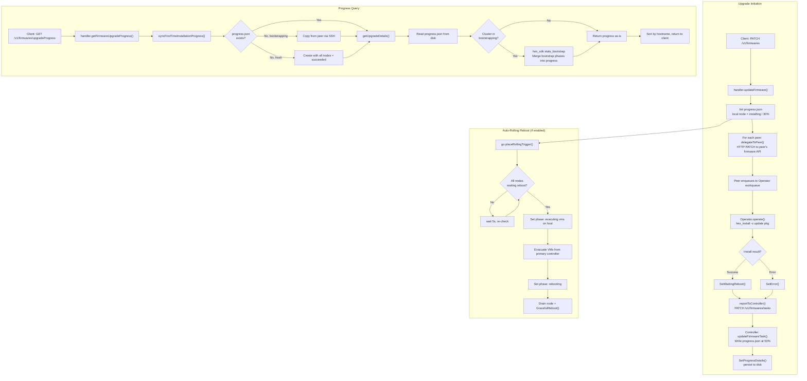

# Firmware Upgrade Progress

This document describes how CubeCOS tracks and reports firmware upgrade progress across cluster nodes.

## Overview

Firmware upgrade progress is tracked via a **local JSON file** (`/var/lib/cube-cos-api/progress.json`) on each node. The VIP (Virtual IP) controller node is the single source of truth — it writes progress updates and syncs the file to all peer nodes via SSH/SCP.

Clients poll `GET /v1/firmwares/upgradeProgress` to retrieve the current state.

## API

### Get Firmware Upgrade Progress

```
GET /v1/firmwares/upgradeProgress
```

**Response:**

```json
{
  "code": 200,
  "status": "ok",
  "msg": "List of firmware upgrade progress",
  "data": {
    "version": "Cube Appliance 3.1.0 20260501-1200",
    "isRollingApplied": true,
    "progresses": [
      {
        "host": "node-1",
        "phase": "partitioning",
        "status": {
          "current": "installing",
          "isProcessing": true,
          "processPercent": 30,
          "isContinueAnywaied": false,
          "description": ""
        }
      }
    ]
  }
}
```

## Data Structures

### `Upgrade`

| Field              | Type         | Description                                       |
| ------------------ | ------------ | ------------------------------------------------- |
| `version`          | `string`     | Target firmware version being installed            |
| `isRollingApplied` | `bool`       | Whether auto-rolling reboot is enabled             |
| `progresses`       | `[]Progress` | Per-node progress entries                          |

### `Progress`

| Field    | Type                     | Description                                                   |
| -------- | ------------------------ | ------------------------------------------------------------- |
| `host`   | `string`                 | Node hostname                                                 |
| `phase`  | `string`                 | Current lifecycle phase (see [Phases](#phases))                |
| `status` | `SystemUpdateProgress`   | Detailed status (see [Status](#systemupdateprogress))         |

### `SystemUpdateProgress`

| Field                | Type      | Description                                            |
| -------------------- | --------- | ------------------------------------------------------ |
| `current`            | `string`  | Current status string (see [Status Values](#status-values)) |
| `isProcessing`       | `bool`    | Whether the node is actively processing                |
| `processPercent`     | `float64` | Progress percentage (0–100)                            |
| `isContinueAnywaied` | `bool`    | Whether a failed node was manually continued           |
| `description`        | `string`  | Error description (populated on failure)               |

## Phases

| Phase                    | Description                                      |
| ------------------------ | ------------------------------------------------ |
| `partitioning`           | Firmware package is being written to the partition|
| `evacuting vms on host`  | VMs are being live-migrated off the node          |
| `rebooting`              | Node is rebooting into the new firmware           |

## Status Values

| Status            | `isProcessing` | `processPercent` | Description                                      |
| ----------------- | -------------- | ---------------- | ------------------------------------------------ |
| `installing`      | `true`         | 30               | `hex_install` is running on the node              |
| `waiting reboot`  | `true`         | 50               | Partition written, waiting for rolling reboot     |
| `rebooting`       | `true`         | 80               | Node is rebooting / bootstrapping                 |
| `succeeded`       | `false`        | 100              | Upgrade completed successfully                    |
| `failed`          | `false`        | 0                | Upgrade failed (see `description` for detail)     |
| `resolved`        | `false`        | 100              | A failed node was continued via "Continue Anyway" |

## Flow

### Sequence Diagram

```
Client          VIP Controller           Peer Node            Operator (workqueue)
  |                   |                      |                        |
  |-- PATCH /firmwares ->                    |                        |
  |                   |                      |                        |
  |                   |-- init progress.json |                        |
  |                   |   (local=installing) |                        |
  |                   |                      |                        |
  |                   |-- HTTP PATCH -------->                        |
  |                   |   (firmware req)     |                        |
  |                   |                      |-- enqueue req -------->|
  |                   |                      |                        |
  |                   |<- sync progress ---- |                        |
  |                   |   (update node entry)|                        |
  |                   |                      |                        |
  |                   |-- SCP progress.json ->  (all nodes)           |
  |                   |                      |                        |
  |                   |                      |     hex_install runs   |
  |                   |                      |                        |
  |                   |                      |<--- install result ----|
  |                   |                      |     (success/error)    |
  |                   |                      |                        |
  |                   |<- PATCH /firmwares/tasks -|                   |
  |                   |   (waiting reboot or failed)                  |
  |                   |                      |                        |
  |                   |-- write progress.json|                        |
  |                   |   (node=50%)         |                        |
  |                   |                      |                        |
  |-- GET /firmwares/upgradeProgress ->      |                        |
  |                   |                      |                        |
  |                   |-- read progress.json |                        |
  |                   |-- (if bootstrapping) |                        |
  |                   |   hex_sdk stats_bootstrap                     |
  |                   |   merge into progress|                        |
  |<-- progress JSON --|                     |                        |
```

### Flowchart



## Key Files

| File | Purpose |
| ---- | ------- |
| `internal/apis/v1/handlers/firmwares/handlers.go` | HTTP handler registration and entry points |
| `internal/apis/v1/handlers/firmwares/helper.go` | Request orchestration, delegates to peers and operators |
| `internal/apis/v1/handlers/firmwares/progress.go` | Progress file management, bootstrapping sync, status aggregation |
| `internal/apis/v1/handlers/firmwares/delegate.go` | Peer node communication (install, reboot delegation) |
| `internal/apis/v1/handlers/firmwares/rolling.go` | Auto-rolling reboot logic, VM evacuation, reboot trigger |
| `internal/apis/v1/handlers/firmwares/record.go` | Firmware task update handler (`updateFirmwareTask`) |
| `internal/operators/v1/firmwares/firmwares.go` | Async operator consuming firmware requests from workqueue |
| `internal/operators/v1/firmwares/operate.go` | Executes `hex_install`, reports result back to controller |
| `internal/cubecos/firmware.go` | Low-level firmware operations: `hex_install`, progress file I/O, SSH sync |
| `internal/definition/v1/firmwares/firmware.go` | Data models (`Upgrade`, `Progress`, `ReqOpts`), file path constants |
| `internal/definition/v1/status/status.go` | Status constants and `SystemUpdateProgress` struct |

## Progress File

**Path:** `/var/lib/cube-cos-api/progress.json`

This file is the persistent store for upgrade progress. It is:

- **Created** by the VIP controller when an upgrade is initiated (`initUpgradeProgress`)
- **Updated** when peer nodes report back (`updateFirmwareTask`) or during rolling reboot phase changes
- **Synced** to all peer nodes via SCP (`SyncFirmwareUpgradeProgressToAllNodes`)
- **Read** on every `GET /firmwares/upgradeProgress` request
- **Deleted** when a firmware update is aborted (`abortFirmwareUpdate`)

## Progress Lifecycle

```
installing (30%) → waiting reboot (50%) → rebooting (80%) → succeeded (100%)
                                                           → failed (0%)
                                                           → resolved (100%)  ← via "Continue Anyway"
```

1. **Installing (30%)** — The operator runs `hex_install -v update <pkg>` on each node. The VIP controller initializes each node at 30%.

2. **Waiting Reboot (50%)** — The operator finishes `hex_install` successfully and reports back. The controller updates the node to 50%.

3. **Rebooting (80%)** — When auto-rolling is enabled, `placeRollingTrigger()` polls until all nodes reach `waiting reboot`, then triggers sequential reboots (VM evacuation → drain → reboot). During this phase, `hex_sdk stats_bootstrap` is used to track bootstrapping progress.

4. **Succeeded (100%)** — The bootstrap script completes with return code `0`.

5. **Failed (0%)** — Any step fails. The `description` field contains the error detail (e.g. `UPG2001: ...`).

6. **Resolved (100%)** — A failed node is manually continued via `POST /firmwares/continueAnyway/:nodeName`, which sets `isContinueAnywaied = true` and triggers a reboot.
