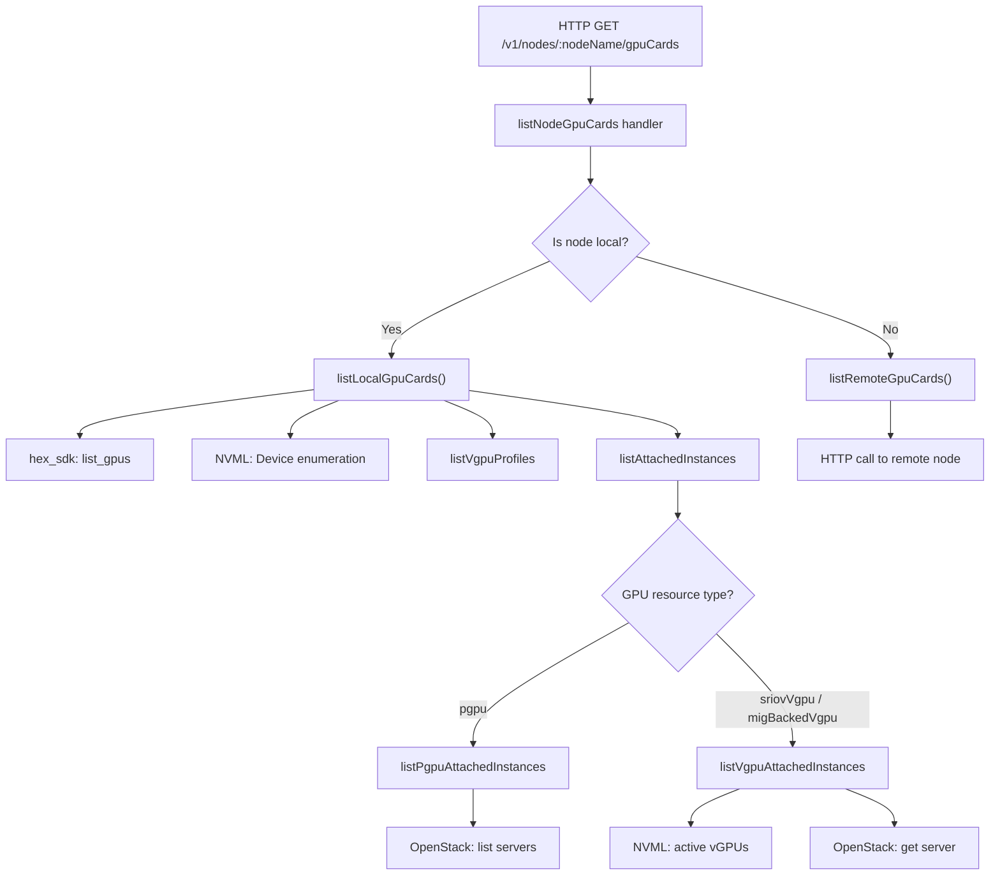
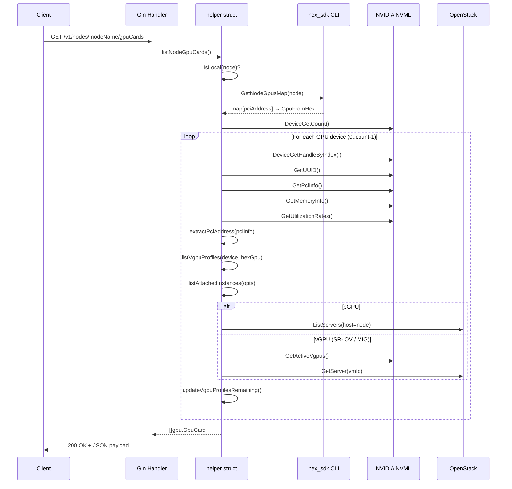
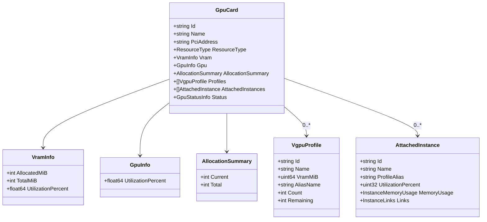
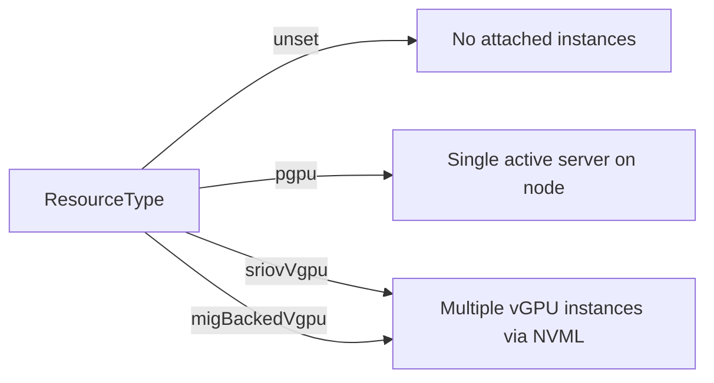

# `listLocalGpuCards` Function Explanation

## Overview

`listLocalGpuCards` is a method on the `helper` struct that queries the **local** node's GPU hardware using NVIDIA's NVML library and returns a detailed inventory of all GPU cards, including VRAM usage, GPU utilization, vGPU profiles, and attached VM instances.

It is the local-node path of `listNodeGpuCards()`, which decides between local and remote execution based on whether the target node is the current machine.

## Architecture Context

## Data Flow

## Step-by-Step Walkthrough

| Step | Action                                                          | Source                        |
| ---- | --------------------------------------------------------------- | ----------------------------- |
| 1    | Fetch GPU metadata from `hex_sdk list_gpus` (JSON)              | `cubecos.GetNodeGpusMap`      |
| 2    | Get total NVIDIA device count via NVML                          | `nvml.DeviceGetCount()`       |
| 3    | **Per device:** get handle, UUID, PCI info, memory, utilization | NVML calls                    |
| 4    | Normalize PCI address (strip 8-char domain → 4-char)            | `extractPciAddress`           |
| 5    | Look up hex metadata by PCI address                             | `hexGpusMap[pciAddress]`      |
| 6    | List vGPU profiles (MIG / SR-IOV only)                          | `listVgpuProfiles`            |
| 7    | List attached VM instances                                      | `listAttachedInstances`       |
| 8    | Calculate remaining profile slots                               | `updateVgpuProfilesRemaining` |
| 9    | Assemble `gpu.GpuCard` struct and append                        | —                             |

## Key Data Structures

## External Dependencies

| Dependency                  | Purpose                                                                                        |
| --------------------------- | ---------------------------------------------------------------------------------------------- |
| `github.com/NVIDIA/go-nvml` | Direct access to NVIDIA GPU hardware (device enumeration, memory, utilization, vGPU instances) |
| `hex_sdk` CLI               | Provides platform-level GPU metadata (ID, name, type, status, allocation, vGPU profile counts) |
| OpenStack Compute API       | Resolves VM instance names and creates VNC console links                                       |
| Grafana                     | Generates per-instance monitoring dashboard URLs                                               |

## Error Handling Strategy

- **Fatal errors** (stop processing): failure to get device count, failure to call `hex_sdk`.
- **Non-fatal errors** (skip device, continue loop): failure to get device handle, UUID, or PCI info for a single device.
- **Non-fatal warnings** (use zero values): failure to get memory info or utilization rates — the card is still reported with zeroed metrics.

## GPU Resource Type Branching

- **pGPU (passthrough):** The entire physical GPU is passed through to one VM. The function finds the active OpenStack server on that node.
- **SR-IOV vGPU / MIG-backed vGPU:** The GPU is partitioned. NVML's `GetActiveVgpus()` returns individual vGPU instances, each mapped to a VM via its VM ID.

## File Location

- **Source:** `internal/apis/v1/handlers/nodes/gpu.go`
- **Handler registration:** `internal/apis/v1/handlers/nodes/handlers.go` (route: `GET /v1/nodes/:nodeName/gpuCards`)
- **Type definitions:** `internal/definition/v1/gpu/gpu.go`
- **hex_sdk integration:** `internal/cubecos/nodes.go`
