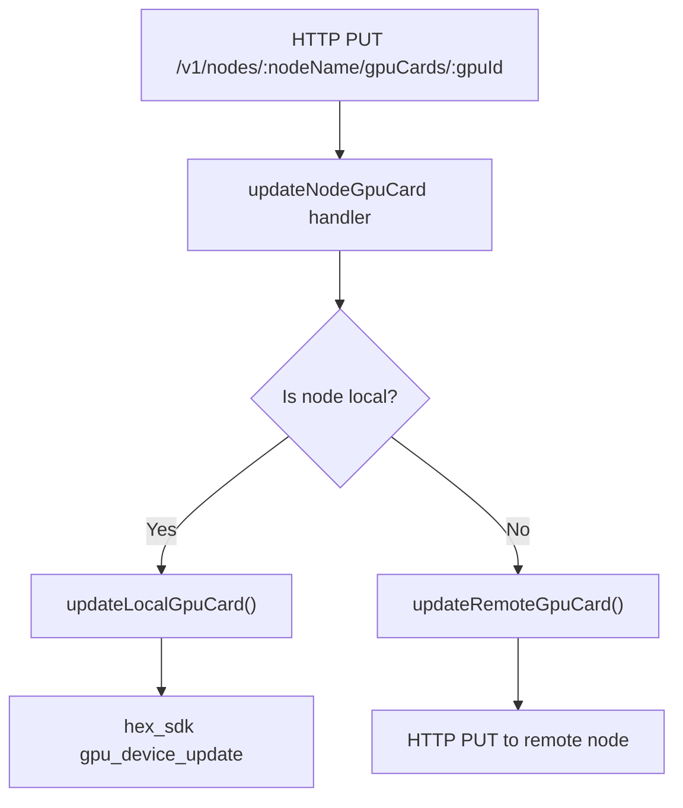
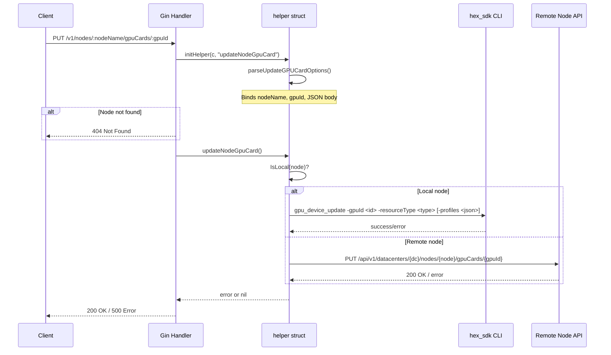
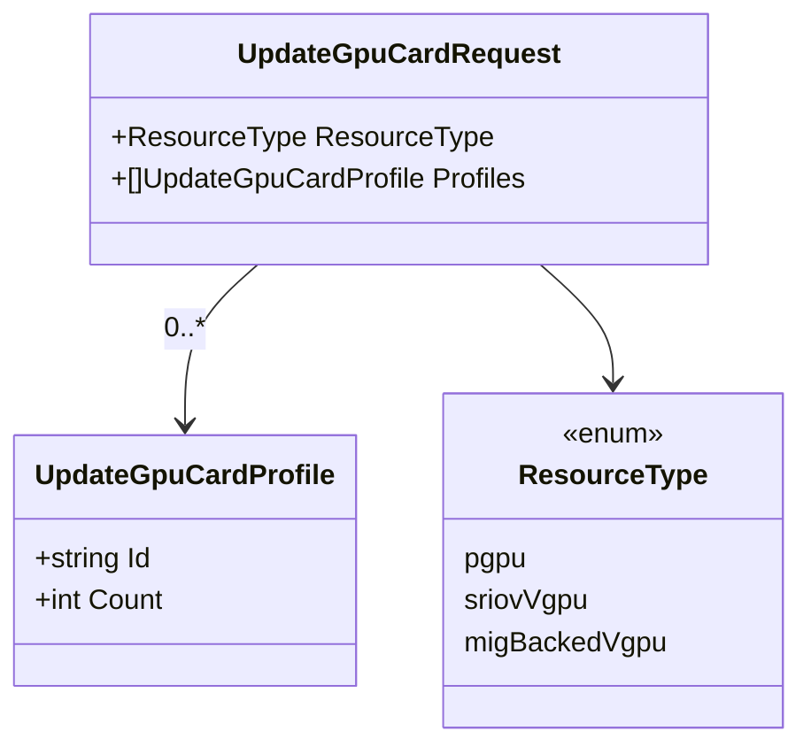

# `updateNodeGpuCard` Function Explanation

## Overview

`updateNodeGpuCard` is a method on the `helper` struct that updates the resource type configuration of a specific GPU card on a node. It allows switching a GPU between passthrough (`pgpu`), SR-IOV vGPU (`sriovVgpu`), and MIG-backed vGPU (`migBackedVgpu`) modes, optionally specifying vGPU profile allocations.

It follows the same local/remote delegation pattern as `listNodeGpuCards()`, executing the update locally via `hex_sdk` or proxying to the target node.

## Architecture Context



## Data Flow



## Request Body

```json
{
  "resourceType": "sriovVgpu",
  "profiles": [
    { "id": "a100-1-5c", "count": 1 },
    { "id": "a100-2-10c", "count": 2 }
  ]
}
```

| Field              | Type   | Required          | Description                                               |
| ------------------ | ------ | ----------------- | --------------------------------------------------------- |
| `resourceType`     | string | Yes               | One of: `pgpu`, `sriovVgpu`, `migBackedVgpu`              |
| `profiles`         | array  | No                | Required for vGPU modes; specifies profile IDs and counts |
| `profiles[].id`    | string | Yes (if profiles) | The vGPU profile identifier                               |
| `profiles[].count` | int    | Yes (if profiles) | Number of instances for this profile                      |

## Response

**200 OK:**
```json
{
  "code": 200,
  "msg": "node GPU card updated successfully",
  "status": "ok"
}
```

**404 Not Found:**
```json
{
  "code": 404,
  "msg": "node <nodeName> not found",
  "status": "not found"
}
```

## Key Data Structures



## Step-by-Step Walkthrough

| Step | Action                                           | Source                                           |
| ---- | ------------------------------------------------ | ------------------------------------------------ |
| 1    | Parse `nodeName` and `gpuId` from URL path       | `parseUpdateGPUCardOptions`                      |
| 2    | Bind JSON request body to `UpdateGpuCardRequest` | `gin.Context.ShouldBindJSON`                     |
| 3    | Verify node exists                               | `nodes.IsExist(h.node)`                          |
| 4    | Check if node is local or remote                 | `nodes.IsLocal(h.node)`                          |
| 5a   | **Local:** call `hex_sdk gpu_device_update`      | `cubecos.UpdateNodeGpuCard`                      |
| 5b   | **Remote:** proxy PUT request to target node     | `h.http.R().Put(node.UpdateGpuCardUrl(...))`     |
| 6    | Return success or error to client                | `bodies.SetOk` / `bodies.SetInternalServerError` |

## External Dependencies

| Dependency    | Purpose                                                                       |
| ------------- | ----------------------------------------------------------------------------- |
| `hex_sdk` CLI | Executes the GPU resource type change on the local node (`gpu_device_update`) |

## Error Handling Strategy

- **400 Bad Request:** Missing `nodeName`, `gpuId`, or malformed JSON body.
- **404 Not Found:** The specified node does not exist in the cluster.
- **500 Internal Server Error:** `hex_sdk` command failure or remote node communication error.

## File Location

- **Source:** `internal/apis/v1/handlers/nodes/gpu.go`
- **Handler registration:** `internal/apis/v1/handlers/nodes/handlers.go` (route: `PUT /v1/nodes/:nodeName/gpuCards/:gpuId`)
- **Parse logic:** `internal/apis/v1/handlers/nodes/parse.go`
- **Type definitions:** `internal/definition/v1/gpu/gpu.go`
- **hex_sdk integration:** `internal/cubecos/nodes.go`
- **Remote URL helper:** `internal/definition/v1/nodes/url.go`
