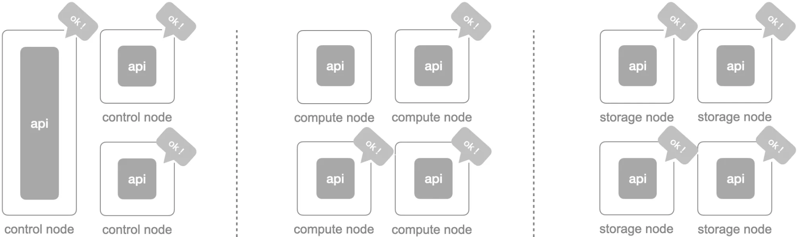
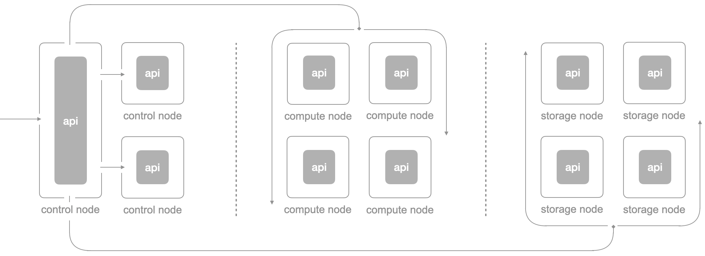
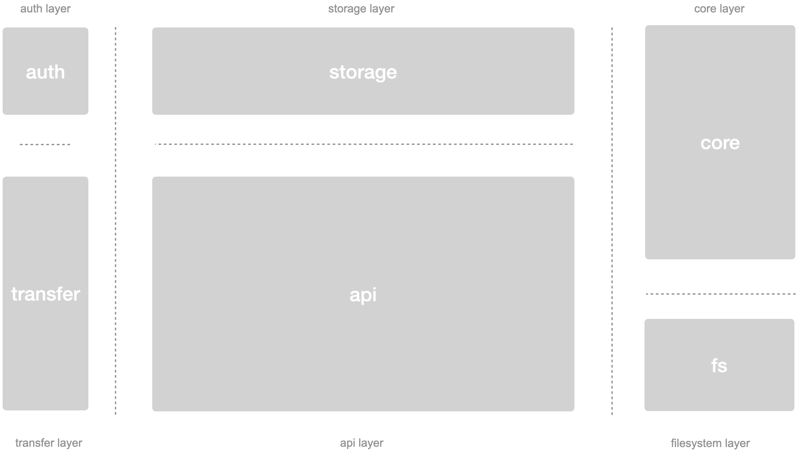
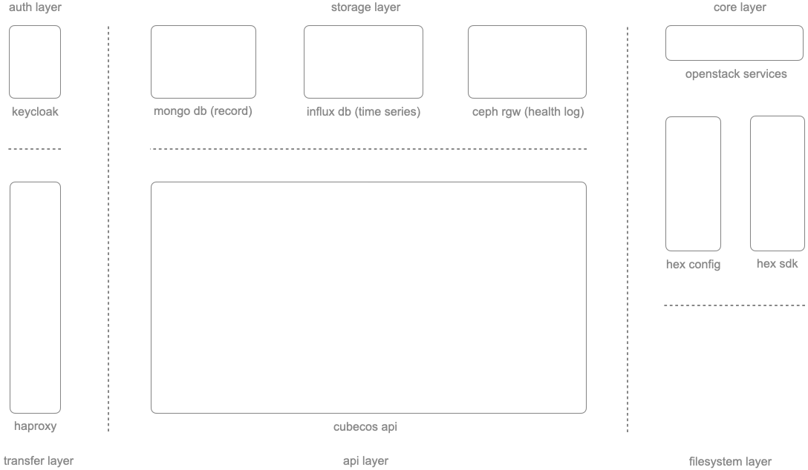
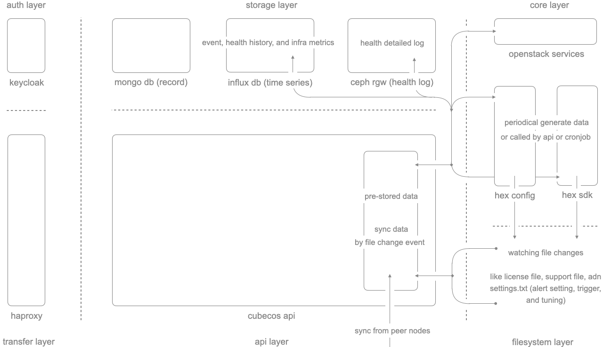
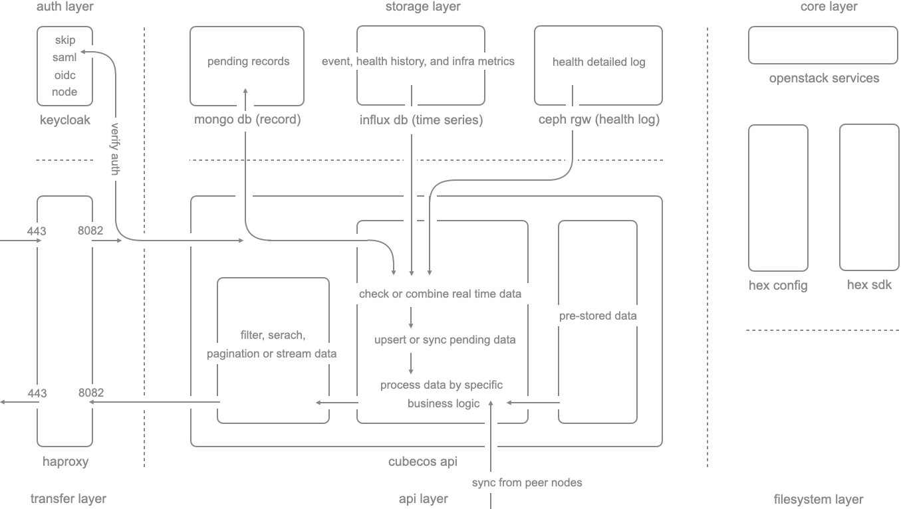
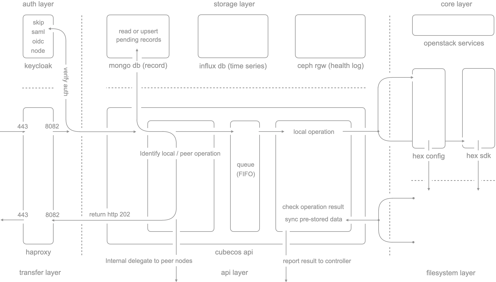
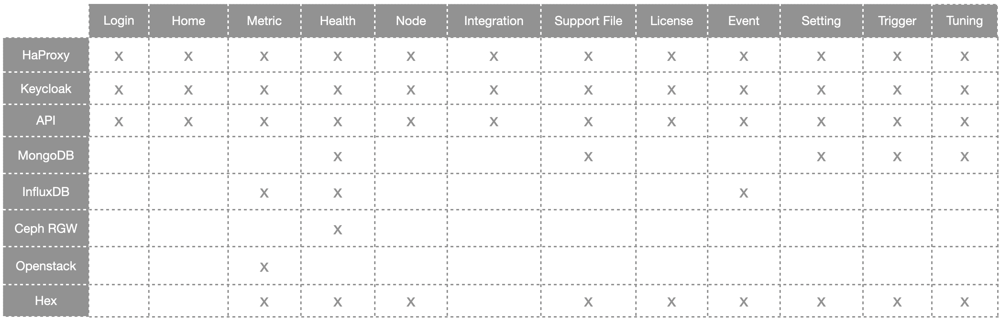

## ▎Architecture - Base

Start from the cube-cos 3.0.0, cube-cos api replace the LMI(legacy UI + API stack) to become a central communication mechanism in the cube-cos. each node has its own cube-cos api and discover peer nodes by MDNS for cross-node communication

<br/>


<br/>
<br/>

Additionally, there’re `14+ apis in the cube-cos`, the `cube-cos api` is just one of apis which responsible for the `partial native features` of CubeCOS currently and will cover more and more features in the incoming milestones.

```bash
(the apis below not includes the k3s api, rancher api, ceph api, and so on...)

$ systemctl --type=service | grep api
  cube-cos-api.service                      loaded active running CubeCosApi
  cyborg-api.service                        loaded active running OpenStack Acceleration API service
  designate-api.service                     loaded active running OpenStack Designate DNSaaS API
  masakari-api.service                      loaded active running OpenStack Masakari Api service
  octavia-api.service                       loaded active running OpenStack Octavia API service
  openstack-cinder-api.service              loaded active running OpenStack Cinder API Server
  openstack-glance-api.service              loaded active running OpenStack Image Service (code-named Glance) API server
  openstack-heat-api-cfn.service            loaded active running Openstack Heat CFN-compatible API Service
  openstack-heat-api.service                loaded active running OpenStack Heat API Service
  openstack-manila-api.service              loaded active running OpenStack Manila API Server
  openstack-nova-api.service                loaded active running OpenStack Nova API Server
  openstack-senlin-api.service              loaded active running OpenStack Senlin API Server
  openstack-watcher-api.service             loaded active running OpenStack Watcher API service
  skyline-apiserver.service                 loaded active running Skyline APIServer
```

<br/>
<br/>

## ▎Architecture - Service Discovery

cube-cos api discover each other through MDNS protocol(`UDP 5353 port`) with a `data center identity`: `{data center name}-{virtual ip}-{first 8 chars of keycloak odic secret}` 

for example: `control-10.32.45.10-g2u1bojz`. the api will broadcast its node details to all peer nodes for `every 20s`.

<br/>


<br/>
<br/>

the payload in the MDNS broadcast is like, for example:

```bash
{
        "metadata": {
                "broker": "http",
                "dataCenter": "control",
                "hostname": "cube451",
                "ip": "10.32.45.1",
                "isGpuEnabled": "false",
                "nodeID": "fd3b8e3f",
                "protocol": "http",
                "registry": "mdns",
                "role": "control-converged",
                "serialNumber": "1MXXZH2",
                "server": "http"
        },
        "service": "control-10.32.45.10-g2u1bojz",
        "version": "latest",
        "endpoints": null
}
```

<br/>

all apis will receive node details through the flow above by identifying the data center identity, then resync the data in the pre-stored data place.



<br/>
<br/>

the TTL of the node details in each node is 60s, when the record is expired, the cube-cos api will ask “who owned the service for {data center identity}” via MDNS broadcast to resync the node list again (⚠️ /etc/settings.cluster.json will also be involved in the process of node sync to know who should be online
)


<br/>
<br/>


<br/>
<br/>

for request communication or delegation, each cube-cos api will know whether the request should be operated locally or delegate to other peer nodes (internal node communication also requires token auth).



<br/>
<br/>
<br/>
<br/>

## ▎Architecture - Inside A Node

from the perspective of single node, there’re 6 layers co-working with the api to handle different  types of request.

<br/>



<br/>
<br/>

the R&R, components, and purpose from the each layer is like

<br/>



<br/>
<br/>

- auth layer
    - check, verify, allow or block the request
- transfer layer
    - do protocol termination and port forward
- core layer
    - the core services of cube-cos, provides everything we need for HCI operation
- api layer
    - handle the request we allow to operate from UI and API
- storage layer
    - persist the pending request, metrics, health history, and event data
- filesystem layer
    - persist the core settings and artifacts of CubeCOS

<br/>
<br/>

## ▎Data Preparation Flow (Request Acceleration)

cube-cos api has an internal data place to prestore the data periodically(or by events from filesystem), so that the incoming request can leverage it immediately. 

<br/>



<br/>
<br/>

the `periodical prestored data` includes:

- health history

<br/>

the `event driven prestored data` includes:

- tuning (watching change from `/etc/settings.txt`)
- alert setting (watching event from `/etc/settings.txt`)
- trigger (watching change from `/etc/settings.txt`)
- support file (watching change from `/var/support/`)

<br/>

the `periodical and event driven prestored mixed data` includes:

- node details (watching change from `node mdns` and `/etc/update`)
- license (watching change from `/etc/update` and `node mdns`)

<br/>
<br/>

## ▎Data Request Flow

when UI send out the GET request to fetch data, the actually first service it meet is the HAProxy rather than the cube-cos api. before respond to UI, there’s a few components which get involved below

<br/>



<br/>
<br/>

- keycloak
    - Auth free: data center listing api, grafana api, and opensearch api
    - UI: auth by SAML
    - Pure API: auth by OIDC or internal node token

<br/>

- haproxy
    - forward the request between internet and intranet by different ports and paths
    - TLS/SSL termination (only do in plain text between api caller and HAProxy)

<br/>

- api
    - fetch data from prestored area, influxdb or other peer nodes
    - sync the pending status / value to current data
    - process data by specific business logic
    - filter or paginate data, then do one time response or continues streaming

<br/>
<br/>

## ▎Operation Request Flow

when UI send out the POST, PATCH, PUT, or DELETE to operate the particular resource, the actual flow in the backend is like

<br/>



<br/>
<br/>

- keycloak
    - same as the Data Request Flow

<br/>

- haproxy
    - same as the Data Request Flow

<br/>

- api
    - check whether it’s cos ready to operate or the same operation is working in progress
    - check whether the resource is valid to operate
    - check whether the incoming new value is valid to operate
    - check whether it’s local apply or should delegate to remote
    - upsert the pending record in the mongodb
    - if it’s local apply, then add a task in the internal queue.
    - if it should be delegated to peer node, then call the same API to peer node.
    - api return the RC 202 to the caller first.
    - background operator(inside the api) will fetch the task via queue, and do it desire to do.
    - background operator report the status to one of control node whatever the result is succeeded or failed.
    - control api update or delete the pending record.
    
<br/>

- ⚠️ notice for API restart when task is not finished yet
  - if the operation is driven by hex tool, then the process won’t be interrupted.
  - during a restart, all pending records which are associated to its node will be purged.

<br/>
<br/>

## ▎Relationship of Service Impact

when you see some unexpected symptom from UI or API, sometime it might not a bug. maybe it’s because cos services are under repairing or can’t function well due to resource overload.

<br/>



<br/>
<br/>

X axis: the features COS provide through UI and API

Y axis: the core services in the COS

for example:

- when Ceph RGW is not working, then it will impact the integrity of health feature
- when InfluxDB is not working, the return of event, health, and metric features will be failed
