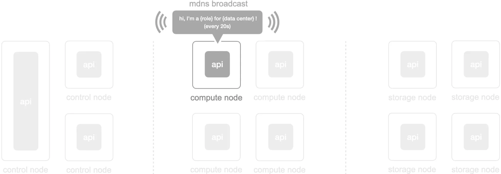
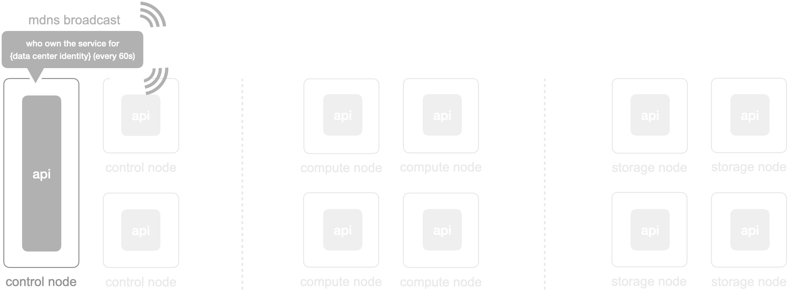
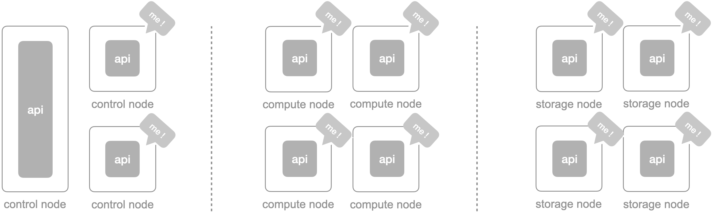

## ▎Architecture - Base

Start from the cube-cos 3.0.0, cube-cos api replace the LMI(legacy UI + API stack) to become a central communication mechanism in the cube-cos. each node has its own cube-cos api and discover peer nodes by MDNS for cross-node communication

<br/>


<br/>
<br/>

Additionally, there’re `14+ apis in the cube-cos`, the `cube-cos api` is just one of apis which responsible for the `partial native features` of CubeCOS currently and will cover more and more features in the incoming milestones.

```bash
(the apis below not includes the k3s api, rancher api, ceph api, and so on...)

$ systemctl --type=service | grep api
  cube-cos-api.service                      loaded active running CubeCosApi
  cyborg-api.service                        loaded active running OpenStack Acceleration API service
  designate-api.service                     loaded active running OpenStack Designate DNSaaS API
  masakari-api.service                      loaded active running OpenStack Masakari Api service
  octavia-api.service                       loaded active running OpenStack Octavia API service
  openstack-cinder-api.service              loaded active running OpenStack Cinder API Server
  openstack-glance-api.service              loaded active running OpenStack Image Service (code-named Glance) API server
  openstack-heat-api-cfn.service            loaded active running Openstack Heat CFN-compatible API Service
  openstack-heat-api.service                loaded active running OpenStack Heat API Service
  openstack-manila-api.service              loaded active running OpenStack Manila API Server
  openstack-nova-api.service                loaded active running OpenStack Nova API Server
  openstack-senlin-api.service              loaded active running OpenStack Senlin API Server
  openstack-watcher-api.service             loaded active running OpenStack Watcher API service
  skyline-apiserver.service                 loaded active running Skyline APIServer
```

<br/>
<br/>

## ▎Architecture - Service Discovery

cube-cos api discover each other through MDNS protocol(`UDP 5353 port`) with a `data center identity`: `{data center name}-{virtual ip}-{first 8 chars of keycloak odic secret}` 

for example: `control-10.32.45.10-g2u1bojz`. the api will broadcast its node details to all peer nodes for `every 20s`.

<br/>



<br/>
<br/>

the payload in the MDNS broadcast is like, for example:

```bash
{
        "metadata": {
                "broker": "http",
                "dataCenter": "control",
                "hostname": "cube451",
                "ip": "10.32.45.1",
                "isGpuEnabled": "false",
                "nodeID": "fd3b8e3f",
                "protocol": "http",
                "registry": "mdns",
                "role": "control-converged",
                "serialNumber": "1MXXZH2",
                "server": "http"
        },
        "service": "control-10.32.45.10-g2u1bojz",
        "version": "latest",
        "endpoints": null
}
```

<br/>

all apis will receive node details through the flow above by identifying the data center identity, then resync the data in the pre-stored data place.


<br/>
<br/>

the TTL of the node details in each node is 60s, when the record is expired, the cube-cos api will ask “who owned the service for {data center identity}” via MDNS broadcast to resync the node list again (⚠️ /etc/settings.cluster.json will also be involved in the process of node sync to know who should be online
)



<br/>
<br/>



<br/>
<br/>

for request communication or delegation, each cube-cos api will know whether the request should be operated locally or delegate to other peer nodes (internal node communication also requires token auth).


<br/>
<br/>
